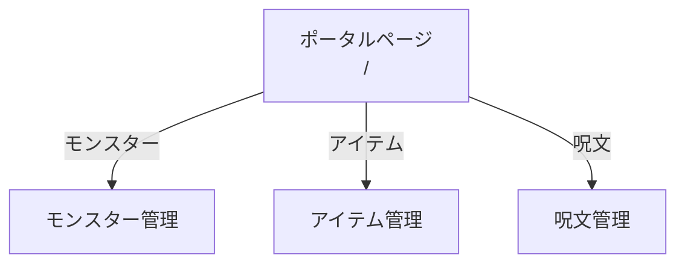
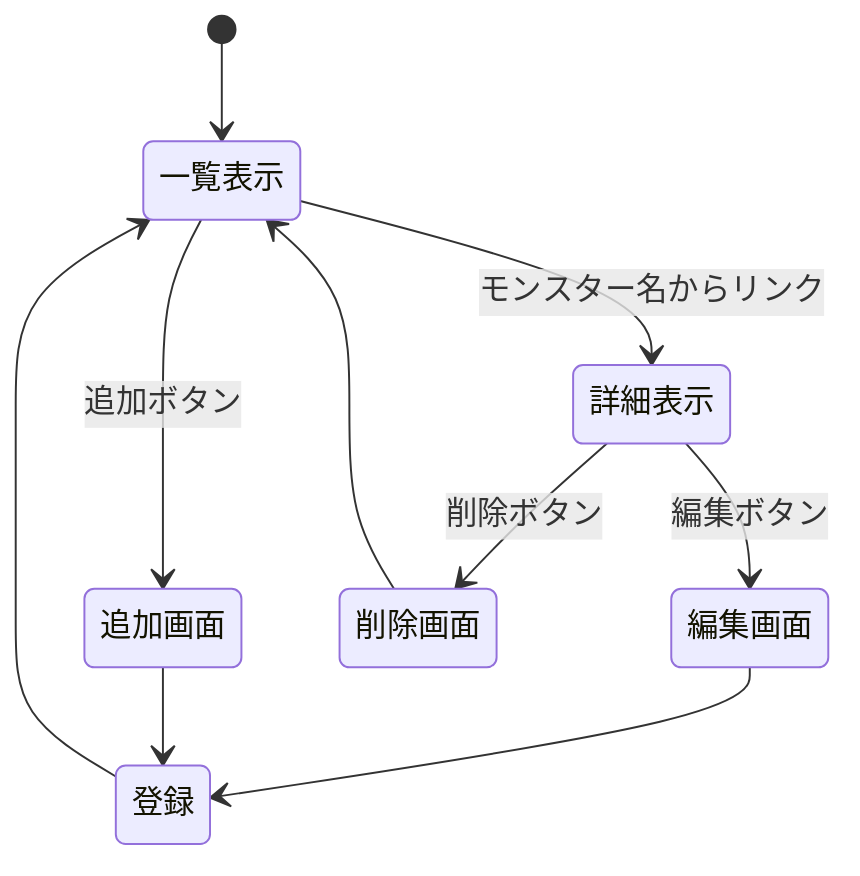
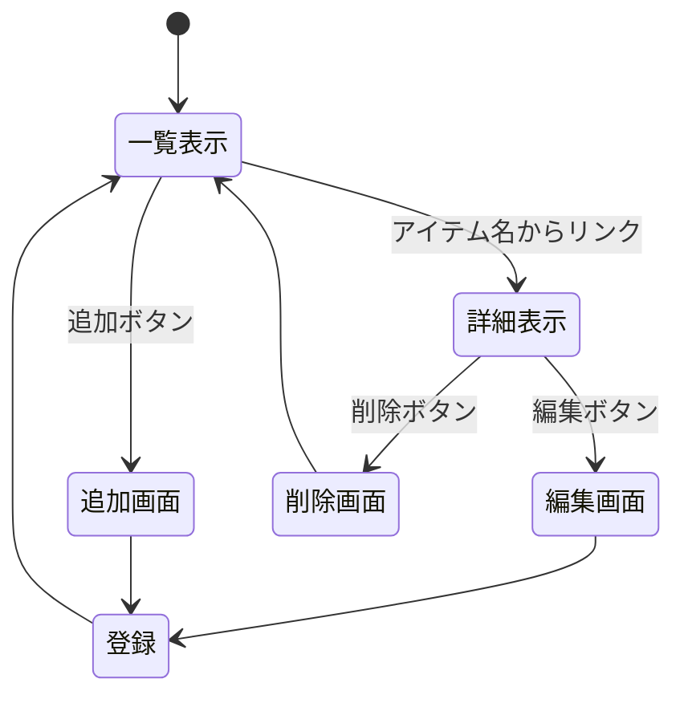
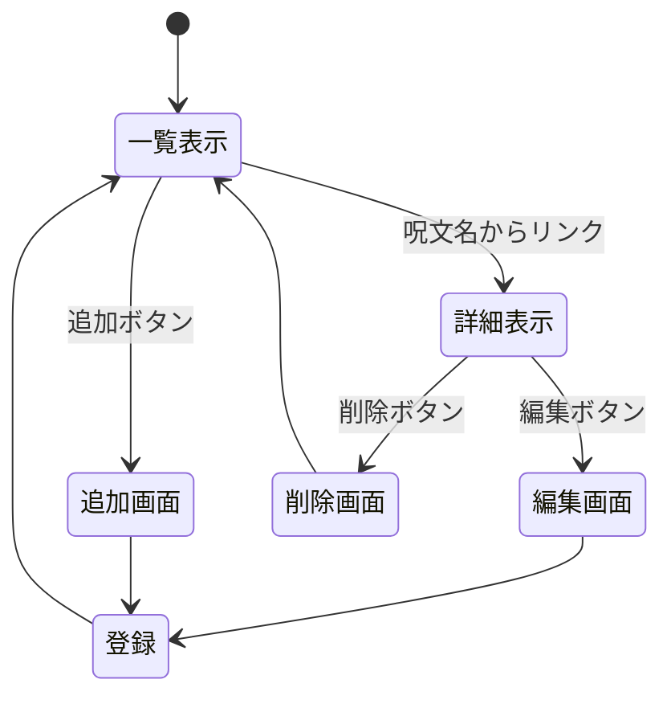

### ドラゴンクエストⅢ関係
京葉線システム以外の一覧表示
ドラゴンクエストⅢのモンスター管理、アイテム管理、呪文管理を一覧表示。

# ドラゴンクエストⅢ 管理システム ページ遷移図

## 全体構成

## モンスター管理システム

## アイテム管理システム

## 呪文管理システム

# ドラゴンクエストⅢ管理システム タスクリスト

## 作業進捗

- [x] 開発者向けドキュメントの作業
  - [x] 対象とするシステムの決定 :white_check_mark:
  - [x] データ構造の決定 :white_check_mark:
  - [x] ページ遷移の検討 :white_check_mark:
  - [x] ページ遷移図の作成 :white_check_mark:
  - [x] HTTPメソッドとリソース名の決定 :thinking:
  - [x] ドキュメントの構成の検討 :thinking:
  - [x] 概要 :writing_hand:
  - [x] データ構造 :writing_hand:
  - [x] HTTPメソッドとリソース名一覧 :writing_hand:
  - [x] リソース名ごとの機能の詳細（モンスター） :writing_hand:
  - [x] リソース名ごとの機能の詳細（アイテム） :writing_hand:
  - [x] リソース名ごとの機能の詳細（呪文） :writing_hand:
- [ ] プログラム開発
  - [ ] プロジェクトの初期設定 :computer:
  - [ ] モンスター管理システムの実装 :computer:
  - [ ] アイテム管理システムの実装 :computer:
  - [ ] 呪文管理システムの実装 :computer:
  - [ ] ポータルページの実装 :computer:
  - [ ] 動作確認 :computer:
  - [ ] Githubへの登録 :computer:
- [ ] 管理者向けドキュメントの作業
  - [ ] インストールから起動までの手順確認 :computer:
  - [ ] インストール方法 :writing_hand:
  - [ ] 起動方法 :writing_hand:
  - [ ] 起動できない場合 :writing_hand:
  - [ ] 終了方法 :writing_hand:
  - [ ] 分かっている不具合 :writing_hand:
- [ ] 利用者向けドキュメントの作業
  - [ ] 構成の検討 :thinking:
  - [ ] スクリーンショットの保存と整理 :computer:
  - [ ] 概要 :writing_hand:
  - [ ] 使用できる機能 :writing_hand:
  - [ ] 起動画面 :writing_hand:
  - [ ] 一覧表示 :writing_hand:
  - [ ] 詳細表示 :writing_hand:
  - [ ] データ追加 :writing_hand:
  - [ ] データ削除 :writing_hand:
  - [ ] データ編集 :writing_hand:
- [ ] 仕様書の統合
  - [ ] 3部構成のPDF作成 :writing_hand:
  - [ ] GithubリポジトリURLの記載 :writing_hand:
- [ ] 提出 :tada:

## 凡例

| 絵文字 | 意味 |
|-|-|
| :thinking: | 検討中 |
| :writing_hand: | 文書作成 |
| :computer: | プログラミング・操作 |
| :white_check_mark: | 完了 |
| :tada: | 提出 |

