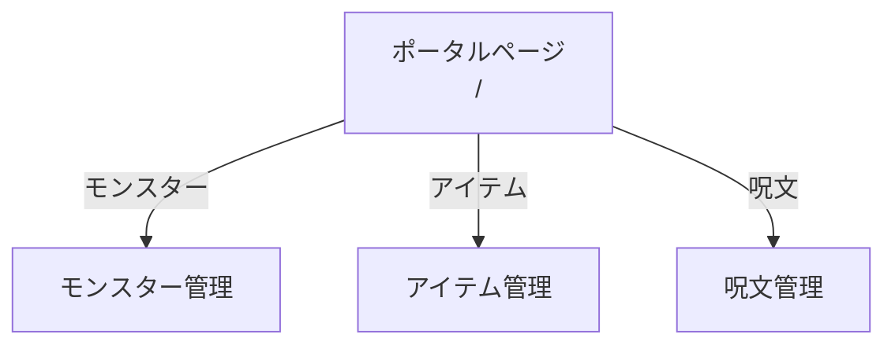
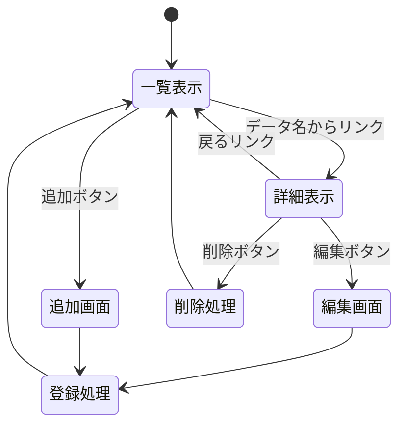

# 開発者向け仕様書

## 概要

本システムは，ドラゴンクエストⅢに登場するモンスター，アイテム，呪文の情報を管理するWebアプリケーションである．統一した操作でデータの一覧表示，詳細表示，追加，削除，変更を行うことができる．

### システム構成

本システムは以下の3つのシステムから構成される．

| システム名 | 説明 | リソース名 |
|-|-|-|
| モンスター管理システム | モンスターの基本情報を管理 | /monsters |
| アイテム管理システム | 武器・防具・道具の情報を管理 | /items |
| 呪文管理システム | 呪文の情報を管理 | /spells |

## データ構造

### モンスターデータ

| キー名 | 型 | 説明 | 例 |
|-|-|-|-|
| id | Number | モンスターID（一意） | 1 |
| name | String | モンスター名 | スライム |
| hp | Number | HP | 8 |
| mp | Number | MP | 0 |
| attack | Number | 攻撃力 | 9 |
| defense | Number | 守備力 | 4 |
| exp | Number | 獲得経験値 | 1 |
| gold | Number | 獲得ゴールド | 1 |
| habitat | String | 出現場所 | アリアハン周辺 |

### アイテムデータ

| キー名 | 型 | 説明 | 例 |
|-|-|-|-|
| id | Number | アイテムID | 1 |
| name | String | アイテム名 | ひのきのぼう |
| type | String | 種類（武器/防具/道具） | 武器 |
| price | Number | 価格（ゴールド） | 5 |
| effect | String | 効果 | 攻撃力+2 |
| equipable | String | 装備可能職業 | 全職業 |

### 呪文データ

| キー名 | 型 | 説明 | 例 |
|-|-|-|-|
| id | Number | 呪文ID | 1 |
| name | String | 呪文名 | ホイミ |
| mp_cost | Number | 消費MP | 3 |
| type | String | 種類（攻撃/回復/補助/移動） | 回復 |
| effect | String | 効果 | 味方1人のHPを約30回復 |
| learner | String | 習得職業 | 僧侶，賢者 |
| level | Number | 習得レベル | 1 |

---

## ページ遷移

### 全体構成

### 各システム共通のページ遷移

3つのシステムは同一のページ遷移構造を持つ．

