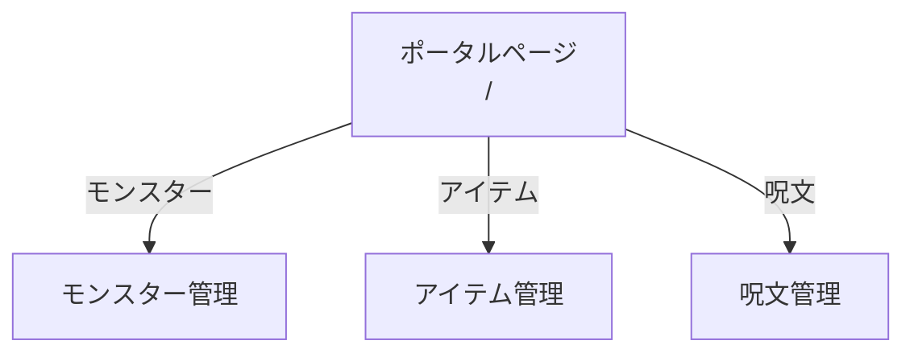
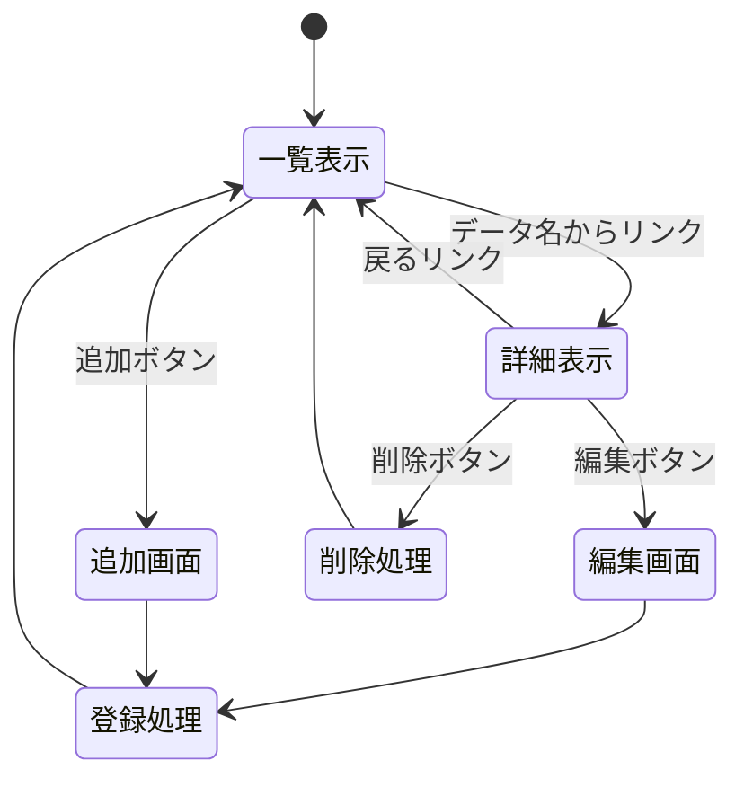

# 開発者向け仕様書

## 概要

本システムは，ドラゴンクエストⅢに登場するモンスター，アイテム，呪文の情報を管理するWebアプリケーションである．統一した操作でデータの一覧表示，詳細表示，追加，削除，変更を行うことができる．

### システム構成

本システムは以下の3つのシステムから構成される．

| システム名 | 説明 | リソース名 |
|-|-|-|
| モンスター管理システム | モンスターの基本情報を管理 | /monsters |
| アイテム管理システム | 武器・防具・道具の情報を管理 | /items |
| 呪文管理システム | 呪文の情報を管理 | /spells |

### 使用技術

| 項目 | 技術 |
|-|-|
| サーバサイド | Node.js + Express |
| テンプレートエンジン | EJS |
| データ保存 | 変数内に記録 |

---

## データ構造

### モンスターデータ

| キー名 | 型 | 説明 | 例 |
|-|-|-|-|
| id | Number | モンスターID（一意） | 1 |
| name | String | モンスター名 | スライム |
| hp | Number | HP | 8 |
| mp | Number | MP | 0 |
| attack | Number | 攻撃力 | 9 |
| defense | Number | 守備力 | 4 |
| exp | Number | 獲得経験値 | 1 |
| gold | Number | 獲得ゴールド | 1 |
| habitat | String | 出現場所 | アリアハン周辺 |

### アイテムデータ

| キー名 | 型 | 説明 | 例 |
|-|-|-|-|
| id | Number | アイテムID | 1 |
| name | String | アイテム名 | ひのきのぼう |
| type | String | 種類（武器/防具/道具） | 武器 |
| price | Number | 価格（ゴールド） | 5 |
| effect | String | 効果 | 攻撃力+2 |
| equipable | String | 装備可能職業 | 全職業 |

### 呪文データ

| キー名 | 型 | 説明 | 例 |
|-|-|-|-|
| id | Number | 呪文ID | 1 |
| name | String | 呪文名 | ホイミ |
| mp_cost | Number | 消費MP | 3 |
| type | String | 種類（攻撃/回復/補助/移動） | 回復 |
| effect | String | 効果 | 味方1人のHPを約30回復 |
| learner | String | 習得職業 | 僧侶，賢者 |
| level | Number | 習得レベル | 1 |

---

## ページ遷移

### 全体構成



### 各システム共通のページ遷移

3つのサブシステムは同一のページ遷移構造を持つ．



---

## HTTPメソッドとリソース名

### 一覧

各システムで統一したリソース名を使用する．`{system}`には`monsters`，`items`，`spells`のいずれかが入る．

| 機能 | HTTPメソッド | リソース名 | 説明 |
|-|-|-|-|
| 一覧表示 | GET | /{system}/index | データ一覧を表示 |
| 詳細表示 | GET | /{system}/show/:id | 指定IDのデータ詳細を表示 |
| 追加画面 | GET | /{system}/new | 新規追加フォームを表示 |
| 追加処理 | POST | /{system}/create | フォームデータを受け取り追加 |
| 編集画面 | GET | /{system}/edit/:id | 指定IDのデータ編集フォームを表示 |
| 更新処理 | POST | /{system}/update/:id | フォームデータを受け取り更新 |
| 削除処理 | POST | /{system}/delete/:id | 指定IDのデータを削除 |

### パラメータについて

`:id`はパスパラメータであり，対象データのIDを指定する．

例：`/monsters/show/1`はID=1のモンスター詳細を表示する．

---

## リソースごとの機能詳細

### モンスター管理システム

#### GET /monsters/index

モンスター一覧を表示する．

**リクエスト例**

```text
GET /monsters/index HTTP/1.1
Host: localhost
```

**レスポンス**

モンスター一覧ページ（HTML）を返す．一覧にはモンスター名，HP，攻撃力，出現場所を表示する．モンスター名をクリックすると詳細ページに遷移する．

#### GET /monsters/show/:id

指定したIDのモンスター詳細を表示する．

**リクエスト例**

```text
GET /monsters/show/1 HTTP/1.1
Host: localhost
```

**レスポンス**

モンスター詳細ページ（HTML）を返す．すべての項目（id，name，hp，mp，attack，defense，exp，gold，habitat）を表示する．編集ボタン，削除ボタン，戻るリンクを配置する．

#### GET /monsters/new

モンスター新規追加フォームを表示する．

**リクエスト例**

```text
GET /monsters/new HTTP/1.1
Host: localhost
```

**レスポンス**

新規追加フォームページ（HTML）を返す．id以外の全項目の入力欄を表示する．

#### POST /monsters/create

新しいモンスターを追加する．

**リクエスト例**

```text
POST /monsters/create HTTP/1.1
Host: localhost
Content-Type: application/x-www-form-urlencoded

name=スライムベス&hp=10&mp=0&attack=11&defense=6&exp=2&gold=2&habitat=アリアハン周辺
```

**レスポンス**

追加処理後，一覧ページにリダイレクトする．

#### GET /monsters/edit/:id

指定したIDのモンスター編集フォームを表示する．

**リクエスト例**

```text
GET /monsters/edit/1 HTTP/1.1
Host: localhost
```

**レスポンス**

編集フォームページ（HTML）を返す．現在の値が入力欄に設定された状態で表示する．

#### POST /monsters/update/:id

指定したIDのモンスター情報を更新する．

**リクエスト例**

```text
POST /monsters/update/1 HTTP/1.1
Host: localhost
Content-Type: application/x-www-form-urlencoded

name=スライム&hp=10&mp=0&attack=9&defense=4&exp=1&gold=1&habitat=アリアハン周辺
```

**レスポンス**

更新処理後，詳細ページにリダイレクトする．

#### POST /monsters/delete/:id

指定したIDのモンスターを削除する．

**リクエスト例**

```text
POST /monsters/delete/1 HTTP/1.1
Host: localhost
```

**レスポンス**

削除処理後，一覧ページにリダイレクトする．

---

### アイテム管理システム

#### GET /items/index

アイテム一覧を表示する．

**レスポンス**

アイテム一覧ページ（HTML）を返す．一覧にはアイテム名，種類，価格，効果を表示する．

#### GET /items/show/:id

指定したIDのアイテム詳細を表示する．

**レスポンス**

アイテム詳細ページ（HTML）を返す．すべての項目（id，name，type，price，effect，equipable）を表示する．

#### GET /items/new

アイテム新規追加フォームを表示する．

**レスポンス**

新規追加フォームページ（HTML）を返す．

#### POST /items/create

新しいアイテムを追加する．

**レスポンス**

追加処理後，一覧ページにリダイレクトする．

#### GET /items/edit/:id

指定したIDのアイテム編集フォームを表示する．

**レスポンス**

編集フォームページ（HTML）を返す．

#### POST /items/update/:id

指定したIDのアイテム情報を更新する．

**レスポンス**

更新処理後，詳細ページにリダイレクトする．

#### POST /items/delete/:id

指定したIDのアイテムを削除する．

**レスポンス**

削除処理後，一覧ページにリダイレクトする．

---

### 呪文管理システム

#### GET /spells/index

呪文一覧を表示する．

**レスポンス**

呪文一覧ページ（HTML）を返す．一覧には呪文名，消費MP，種類，効果を表示する．

#### GET /spells/show/:id

指定したIDの呪文詳細を表示する．

**レスポンス**

呪文詳細ページ（HTML）を返す．すべての項目（id，name，mp_cost，type，effect，learner，level）を表示する．

#### GET /spells/new

呪文新規追加フォームを表示する．

**レスポンス**

新規追加フォームページ（HTML）を返す．

#### POST /spells/create

新しい呪文を追加する．

**レスポンス**

追加処理後，一覧ページにリダイレクトする．

#### GET /spells/edit/:id

指定したIDの呪文編集フォームを表示する．

**レスポンス**

編集フォームページ（HTML）を返す．

#### POST /spells/update/:id

指定したIDの呪文情報を更新する．

**レスポンス**

更新処理後，詳細ページにリダイレクトする．

#### POST /spells/delete/:id

指定したIDの呪文を削除する．

**レスポンス**

削除処理後，一覧ページにリダイレクトする．

---

## ファイル構成

```text
webpro_06/
├── app.js              # メインアプリケーション
├── package.json        # 依存関係
├── data/
│   ├── monsters.js     # モンスターデータ
│   ├── items.js        # アイテムデータ
│   └── spells.js       # 呪文データ
├── views/
│   ├── monsters/
│   │   ├── index.ejs   # モンスター一覧
│   │   ├── show.ejs    # モンスター詳細
│   │   ├── new.ejs     # モンスター追加
│   │   └── edit.ejs    # モンスター編集
│   ├── items/
│   │   ├── index.ejs   # アイテム一覧
│   │   ├── show.ejs    # アイテム詳細
│   │   ├── new.ejs     # アイテム追加
│   │   └── edit.ejs    # アイテム編集
│   ├── spells/
│   │   ├── index.ejs   # 呪文一覧
│   │   ├── show.ejs    # 呪文詳細
│   │   ├── new.ejs     # 呪文追加
│   │   └── edit.ejs    # 呪文編集
│   └── index.ejs       # ポータルページ
└── public/
    └── style.css       # スタイルシート
```